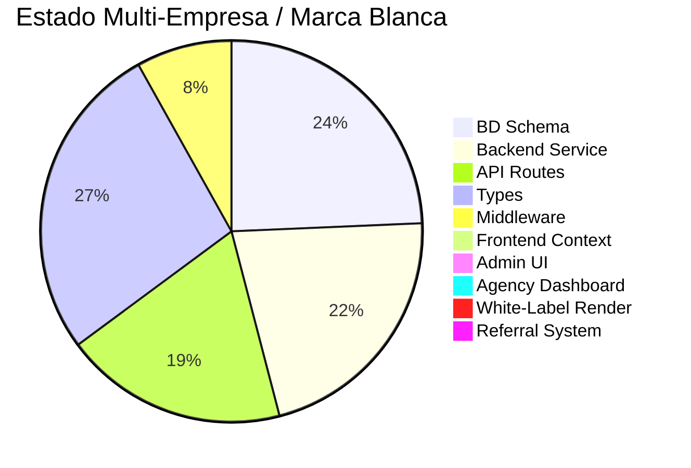

# 📊 Informe: Multi-Empresa y Marca Blanca - Estado Actual y Pendientes

**Fecha:** 10 de Febrero de 2026  
**Versión actual del proyecto:** v2.302  
**Propósito:** Análisis completo del estado de las funcionalidades Multi-Empresa (Multi-Tenant) y Marca Blanca (White-Label)

---

## 🎯 Visión Original

Según [ESPECIFICACION-COMPLETA.md](file:///g:/Otros%20ordenadores/Mi%20PC/operadora-dev/.same/ESPECIFICACION-COMPLETA.md#L417-L744), la plataforma fue diseñada como:

> **Sistema multi-tenant (multi-empresa), multi-moneda para gestión de viajes y eventos.**
> - **Modelo de Negocio:** B2B2C (Business to Business to Consumer)
> - Plataforma central que sirve a múltiples empresas
> - Cada empresa sirve a sus propios clientes
> - White-label para agencias

### Jerarquía de Usuarios Planeada

```
┌─────────────────────────────────────┐
│   SUPER ADMIN (AS OPERADORA)        │
│   - Administra toda la plataforma   │
└──────────────┬──────────────────────┘
               │
       ┌───────┴───────┬─────────────┬──────────────┐
       │               │             │              │
   ┌───▼────┐    ┌────▼─────┐  ┌───▼──────┐  ┌───▼──────┐
   │USUARIO │    │EMPRESA/  │  │ AGENCIA  │  │ USUARIO  │
   │ FINAL  │    │CORPORAT. │  │          │  │ TERCERO  │
   └────────┘    └──────────┘  └────┬─────┘  └──────────┘
                                     │
                              ┌──────▼───────┐
                              │SUB-CLIENTES  │
                              │  DE AGENCIA  │
                              └──────────────┘
```

---

## ✅ Lo Que YA EXISTE (Implementado)

### 1. Base de Datos — 90% Lista

La estructura de BD tiene `tenant_id` como foreign key en **14+ tablas**, lo cual es excelente:

| Componente | Estado | Detalle |
|:-----------|:------:|:--------|
| Tabla `tenants` | ✅ | Con campos: company_name, legal_name, tax_id, logo_url, colors, custom_domain |
| FK `tenant_id` en users | ✅ | Aislamiento de datos por empresa |
| FK `tenant_id` en bookings | ✅ | Reservas por empresa |
| FK `tenant_id` en payments | ✅ | Pagos por empresa |
| FK `tenant_id` en documents | ✅ | Documentos por empresa |
| FK `tenant_id` en communication | ✅ | Centro de comunicación por empresa |
| Tabla `tenant_users` | ✅ | User-to-tenant mapping con roles |
| Tabla `white_label_config` | ✅ | Configuración visual por agencia |
| Tabla `agency_clients` | ⚠️ | Especificada pero no verificada en BD actual |
| Tabla `agency_commissions` | ⚠️ | Especificada pero no verificada en BD actual |
| Tabla `travel_policies` | ✅ | Políticas de viaje por empresa |
| Tabla `travel_approvals` | ✅ | Aprobaciones por empresa |

---

### 2. Backend Service — [TenantService.ts](file:///g:/Otros%20ordenadores/Mi%20PC/operadora-dev/src/services/TenantService.ts) — 80% Listo

El servicio tiene **15+ métodos** implementados:

| Método | Estado | Función |
|:-------|:------:|:--------|
| `getTenantById()` | ✅ | Obtener tenant por ID |
| `getTenantByDomain()` | ✅ | Buscar por dominio personalizado |
| `getTenantBySubdomain()` | ✅ | Buscar por subdominio (ej: agencia1.asoperadora.com) |
| `detectTenant()` | ✅ | Detectar tenant desde host del request |
| `createTenant()` | ✅ | Crear nueva empresa/agencia |
| `updateTenant()` | ✅ | Actualizar datos del tenant |
| `getWhiteLabelConfig()` | ✅ | Obtener config visual de agencia |
| `updateWhiteLabelConfig()` | ✅ | Actualizar colores/logo/etc de agencia |
| `addUserToTenant()` | ✅ | Agregar usuario a empresa |
| `getTenantUsers()` | ✅ | Listar usuarios de empresa |
| `getUserTenants()` | ✅ | Ver a qué empresas pertenece un usuario |
| `userBelongsToTenant()` | ✅ | Verificar membresía |
| `getUserRoleInTenant()` | ✅ | Obtener rol en empresa |
| `removeUserFromTenant()` | ✅ | Remover usuario (soft delete) |
| `getTenantStats()` | ✅ | Estadísticas del tenant |
| `listTenants()` | ✅ | Listar con paginación y filtros |

---

### 3. API Routes — 70% Listas

| Endpoint | Estado | Funcionalidad |
|:---------|:------:|:-------------|
| `GET /api/tenants` | ✅ | Listar tenants |
| `POST /api/tenants` | ✅ | Crear tenant + white-label config |
| `GET /api/tenants/[id]` | ✅ | Obtener tenant (incluye white-label si es agencia) |
| `PUT /api/tenants/[id]` | ✅ | Actualizar tenant + white-label |
| `DELETE /api/tenants/[id]` | ✅ | Soft delete del tenant |

---

### 4. Middleware — [middleware.ts](file:///g:/Otros%20ordenadores/Mi%20PC/operadora-dev/src/middleware.ts) — 30% Listo

El middleware detecta host y prepara headers, pero tiene **TODOs críticos**:

```typescript
// Línea 54: TODO: Aquí harías la consulta a la BD para obtener el tenant
// Línea 61: TODO: Consultar en la BD si existe un tenant con este custom_domain
```

> [!WARNING]
> El middleware detecta subdominios y dominios personalizados, pero **siempre retorna `null`**. No está conectado a la base de datos.

---

### 5. TypeScript Types — 100% Listos

| Tipo | Archivo | Estado |
|:-----|:--------|:------:|
| `Tenant` | types/index.ts | ✅ |
| `TenantUser` | types/index.ts | ✅ |
| `TenantType` | types/index.ts | ✅ |
| `TenantContext` | types/index.ts | ✅ |
| `WhiteLabelConfig` | TenantService.ts | ✅ |
| `TenantEntity` | types/api.ts | ✅ |
| DB types con tenant_id | types/database.ts | ✅ |

---

## ❌ Lo Que FALTA (Pendiente de Implementar)

### A. Frontend — El Hueco Principal

| Componente | Prioridad | Descripción |
|:-----------|:---------:|:------------|
| **WhiteLabelContext.tsx** | 🔴 ALTA | Context de React para cargar y distribuir configuración de branding dinámico |
| **useWhiteLabel() hook** | 🔴 ALTA | Hook para acceder a colores, logo, nombre del tenant actual |
| **Logo dinámico en Header** | 🔴 ALTA | Mostrar logo del tenant en vez del de AS Operadora |
| **Colores dinámicos (CSS vars)** | 🔴 ALTA | Aplicar `primary_color`, `secondary_color` como variables CSS |
| **Footer personalizado** | 🟡 MEDIA | Mostrar info de la agencia en footer |
| **Emails con branding** | 🟡 MEDIA | Templates de email usando colores/logo del tenant |

---

### B. Middleware — Conectar a BD

| Tarea | Prioridad | Detalle |
|:------|:---------:|:-------|
| Conectar detección de subdominio a BD | 🔴 ALTA | Usar `TenantService.getTenantBySubdomain()` |
| Conectar detección de dominio custom a BD | 🔴 ALTA | Usar `TenantService.getTenantByDomain()` |
| Pasar config al frontend vía cookie/header | 🔴 ALTA | Para que `WhiteLabelContext` pueda leerla |

---

### C. Panel de Administración de Tenants

| Componente | Prioridad | Descripción |
|:-----------|:---------:|:------------|
| Página `/admin/tenants` | 🔴 ALTA | CRUD visual de empresas/agencias |
| Formulario de creación de tenant | 🔴 ALTA | Nombre, tipo, logo, colores, dominio |
| Configuración White-Label UI | 🔴 ALTA | Editor visual de branding para agencias |
| Gestión de usuarios por tenant | 🟡 MEDIA | Asignar/remover usuarios |

---

### D. Sistema de Agencias

| Componente | Prioridad | Descripción |
|:-----------|:---------:|:------------|
| Dashboard de Agencia | 🟡 MEDIA | Vue de ventas, comisiones, clientes |
| Sistema de Comisiones UI | 🟡 MEDIA | Configurar % comisión, ver ingresos |
| Links de Referido | 🟡 MEDIA | Generar `?r=AGENCIA123` y tracking |
| CRM de Clientes (agencia) | 🟠 BAJA | Gestionar clientes de la agencia |

---

### E. Flujo de Usuario Tercero (White-Label)

| Componente | Prioridad | Descripción |
|:-----------|:---------:|:------------|
| Detección de `?r=CODIGO` en URL | 🟡 MEDIA | Guardar referral en cookie |
| Markup de precios por agencia | 🟡 MEDIA | Aplicar sobreprecio configurable |
| Registro vinculado a agencia | 🟡 MEDIA | Auto-vincular cliente a agencia |

---

## 📊 Resumen de Completitud



| Capa | % Completado | Faltante Principal |
|:-----|:------------:|:------------------|
| Base de Datos | **90%** | Verificar tablas agency_clients/agency_commissions en BD actual |
| Backend Service | **80%** | Métodos de comisiones, referrals |
| API Routes | **70%** | Endpoints de comisiones, referrals, agency clients |
| TypeScript Types | **100%** | — |
| Middleware | **30%** | Conectar a BD (actualmente retorna null siempre) |
| Frontend Context | **0%** | No existe WhiteLabelContext.tsx |
| Admin UI Tenants | **0%** | No existe página /admin/tenants |
| Dashboard Agencia | **0%** | No existe |
| Rendering White-Label | **0%** | No se aplican colores/logos dinámicos |
| Sistema Referrals | **0%** | No existe |
| **PROMEDIO GENERAL** | **~45%** | **El backend está bien avanzado, falta todo el frontend** |

---

## 🎯 Plan Sugerido de Implementación (por fases)

### Fase 1: Infraestructura Core (3-4 días)
1. Conectar `middleware.ts` a BD para detección real de tenants
2. Crear `WhiteLabelContext.tsx` + `useWhiteLabel()` hook
3. Implementar CSS variables dinámicas desde configuración del tenant
4. Logo dinámico en Header/PageHeader

### Fase 2: Panel Admin (3-4 días)
5. Página `/admin/tenants` con CRUD completo
6. Editor visual de White-Label (preview en tiempo real)
7. Gestión de usuarios por tenant

### Fase 3: Agencias y Comisiones (4-5 días)
8. Verificar/crear tablas `agency_clients` y `agency_commissions` en BD
9. APIs de comisiones y clientes de agencia
10. Dashboard de agencia
11. Sistema de links de referido

### Fase 4: Flujo White-Label Completo (3-4 días)
12. Detección de referral code en URL
13. Markup de precios por agencia
14. Emails con branding del tenant
15. Registro auto-vinculado a agencia

**Estimado total: 13-17 días de desarrollo**

---

## ❓ Preguntas para el Usuario

1. **¿Cuál es la prioridad?** ¿Empezamos por la Fase 1 (infraestructura core) o hay algún componente específico que necesites primero?

2. **¿Tienes ya alguna agencia de prueba** que quieras registrar como tenant? Esto nos ayudaría a probar el flujo completo.

3. **¿El dominio `as-ope-viajes.company` será el dominio principal,** y los subdominios serán tipo `agencia1.as-ope-viajes.company`? ¿O planeas usar `asoperadora.com`?

4. **¿Las agencias podrán auto-registrarse** o solo el SUPER_ADMIN las crea?

5. **¿Quieres que el sistema de comisiones sea funcional desde el inicio** (con cálculos reales) o primero solo la estructura visual?

6. **¿Hay alguna funcionalidad adicional** que no esté en la especificación original que quieras agregar ahora?
